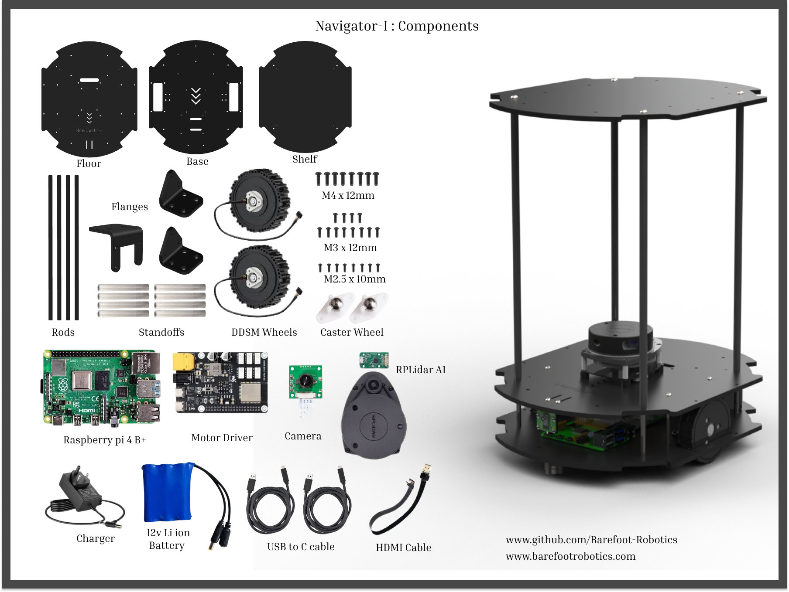

# Hardware Setup Guide

This guide provides the instructions necessary to assemble the Navigator-I robot and establish a remote connection to its onboard computer.



## Component List

| Category | Component | Specification |
|----------|-----------|---------------|
| **CPU** | Raspberry Pi 4B+ | 1.5GHz 64-bit quad-core processor, up to 8GB of LPDDR4 RAM, dual 4K display outputs, Gigabit Ethernet, and dual-band Wi-Fi.|
| **Motor Driver** | DDSM Driver HAT (B) | 6-channel hub motor interface, 9-28V power support, and built-in Wi-Fi |
| **Lidar** | Slamtec RPLIDAR A1| 12-meter range, an 8000 Hz sampling rate, and produces 2D point cloud data ideal for mapping|
| **Camera** | UC-261 (OV5647) | CSI interface, 640×480 working resolution, M12-mount camera module powered by the Omnivision OV5647 5MP sensor |
| **Motors** | DDSM 400 | direct-drive hub motor that integrates a Permanent Magnet Synchronous Motor (PMSM), driver, and 12-bit encoder into a single compact unit |
| **Wheels** | Caster Wheel | 2x High-torque motors with integrated quadrature encoders |
| **Chassis** | Navigator Frame | 180mm × 120mm × 60mm footprint |
| **Attachments** | Connecting Rods x4 | 4 Connecting Rods to Attach Shelf |
| **Sensors** | IMU | 6-axis Inertial Measurement Unit for odometry fusion |
| **Storage** | MicroSD Card | 32GB+ Class 10 with Ubuntu 22.04 LTS |
| **Power** | Battery, Charger | 12V,4h battery backup|
| **Control** | Joystick | Manual Control |
| **Accessories** | Camera Flange, Wheel Flange x2 | Flanges to mount camera and wheels |
| **Consumables** | Screws, Nuts, Cables| - |


## Assembly Instructions

### 1. Drive System Assembly
1.  **Mount Motors:** 
    - Attach the two direct-drive hub motors to the lower chassis plate using the mounting brackets and M3 screws.
2.  **Caster Wheel:** 
    - Install the omnidirectional caster wheel at the rear and front of the base plate on opposite side.

### 2. Electronics Mounting
1.  **Raspberry Pi:** 
    - Secure the Raspberry Pi 4B to the front deck using M2.5 nylon standoffs and Nuts as shown in above image.
2.  **Motor Driver:** 
    - Attach the DDSM motor Drive to the middle of the base plate using M2.5 Nylon standoffs and nuts as shown in above image.
3.  **Battery:** 
    - Mount the battery on the back of the base plate using zip tie as shown in above image.
4.  **Camera:** 
    - Mount the UC-261 camera module to the front-facing bracket on top plate. Gently insert the CSI ribbon cable into the Pi's camera port (ensure the blue side faces the Ethernet ports).
5.  **Lidar:** 
    - Mount the Lidar sensor on the topmost "island" plate. This ensures the laser path is not obstructed by the chassis or other components. 


### 3. Wiring
1.  **Motor Driver and Power board:** 
    - Connect the DDSM motor driver to raspberrypi using USB C cable. 
2.  **Sensors:** 
    - Connect the Lidar via USB to raspberrypi.
3.  **Power:** 
    - Connect the power board to the Raspberry Pi vis USB C cable. 
    - Connect Power board to DDSM Driver with given power jack cable. 
    - Connect 12v power jack of battery to the power board.

## Network Configuration

Before you can connect via SSH, the Navigator must be connected to your local Wi-Fi network.

### 1. Setting Up Wi-Fi (Headless)
If you are using the recommended **Raspberry Pi Imager** to flash your SD card:
 
1.  Click the **Edit Settings** (gear icon) before clicking "Write".

2.  Enable **Set hostname** and enter `navigator`.

3.  Enable **Configure wireless LAN** and enter your Wi-Fi SSID and Password.
4.  Set the **Wireless LAN country** (e.g., US, GB).
5.  Click **Save** and then write the OS to the card.

If the SD card is already flashed with Ubuntu 22.04:
1.  Insert the SD card into your workstation.
2.  Open the partition named `system-boot`.
3.  Edit the file named `network-config`.
4.  Under the `wifis:` section, uncomment the lines and enter your SSID and password.
5.  Save the file, eject the card, and insert it into the Raspberry Pi.

### 2. First Boot
Insert the SD card, power on the robot, and wait 2–3 minutes for the first-time initialization to complete and for the robot to join your network.

## Connecting via SSH

Since the Navigator is an autonomous mobile robot, it is typically operated "headlessly" (without a monitor) via SSH.

### 1. Identify Connection Details
The robot is pre-configured with the following network identity:
- **Hostname:** `navigator.local`
- **Username:** `pi`

### 2. Connect from your Workstation
Open a terminal on your computer and run:

```bash
ssh pi@navigator.local
```
*The default username is typically `ubuntu` for ROS 2 Humble installations.*

### 3. Install Navigator Package

Please follow the [installation](installation.md) steps to install navigator package.

### 4. Configure the Environment
Add the following to your `~/.bashrc` on the robot to ensure ROS 2 is ready every time you log in:

```bash
echo "source /opt/ros/humble/setup.bash" >> ~/.bashrc
echo "source ~/navigator_ws/install/setup.bash" >> ~/.bashrc
source ~/.bashrc
```


## Running Hardware Commands

Once connected via SSH, you can bring up the robot hardware to verify the setup.

### Launch Core Hardware
This command starts the Lidar, Camera, and Motor controllers simultaneously:

```bash
ros2 launch navigator_bringup hardware.launch.py
```

### Launch Full Navigation Stack
This command starts the launch file for Autonomous Navigation:

```bash
# With SLAM
ros2 launch navigator_bringup navigation.launch.py slam:=True
```
or
```bash
# With Map
ros2 launch navigator_bringup navigation.launch.py map:=home/user/path/to/yourmap.yaml
```

### Verify Sensor Data
Open a second SSH terminal and check that the hardware topics are active:

```bash
# Check for active topics
ros2 topic list

# Verify Lidar output
ros2 topic hz /scan

# Check Camera status
ros2 topic hz /camera/image_raw
```

### Check Undervoltage
If the hardware fails to initialize or the Pi throttles, check for power issues:
```bash
vcgencmd get_throttled
```
*A result of `0x0` means your 5V/3A supply is stable.*